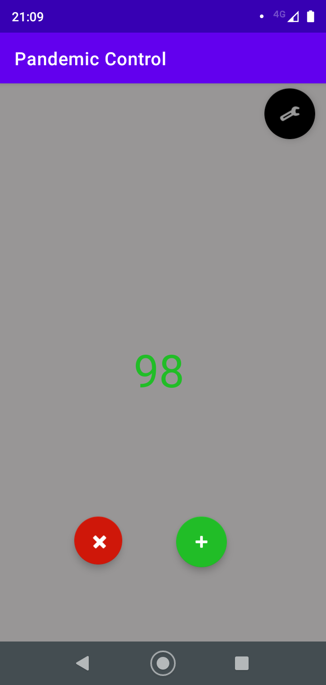
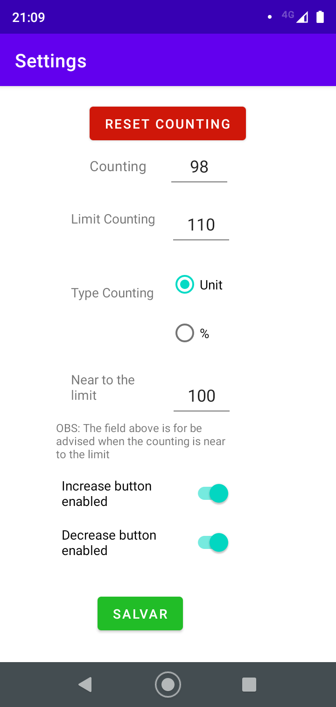

# PandemicControlApp

[

This is a simple app for use on supermarkets, events, partys or others establishments during the pandemic, to control and know exactly how much people are inside, to
prevent the virus to spread easily

## The App

Is only compound by 2 activities, the main and the user preferences one.

* Main Activity

The main activity is where the user will increase and decrease the counting and go to the user preferences. This is all the user can do in the activity, is very simple and intuitive.

* User Preferences Activity

This is where the user can configure what the users can do and the limits for the counting

### Elements

* Reset Counting: Is for reset the counting to 0, to start over again;
* Counting: Is the current counting, that you can see on the main, is editable if is needed to increase/decrease faster;
* Limit Counting: The number limit of the couting, when gets to it, in the main activity the increase button is disabled;
* Type Conting: Is for stipulate the metric on the field below, if is a fixed number (lower then the limit) or a percent of the limit;
* Near the limit: Is the value about the metric above, based on the limit counting. This value don't block the buttons on the main activity, only turn the
color to yellow as an advise;
* Increase/Decrease button enabled: If the increase/decrease buttons are clickables by the user on the main. 

## COUNTRIBUTING

This app is very simple and the code may be a little coupled. This was my first Android app, build all by myself, I'm a little new to the Android and mobile in general development. So be free to contribute, give me advices and new ideas.
The app is not distributed, can only be used local, by a single user. This is a new feature to be implemented as a future work.

